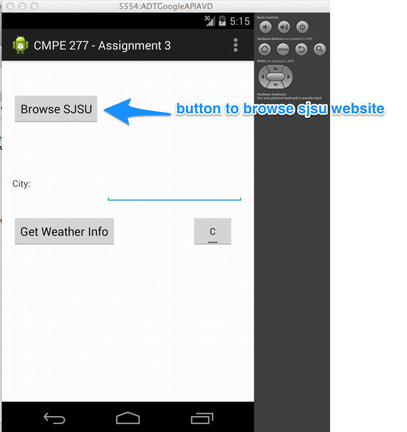
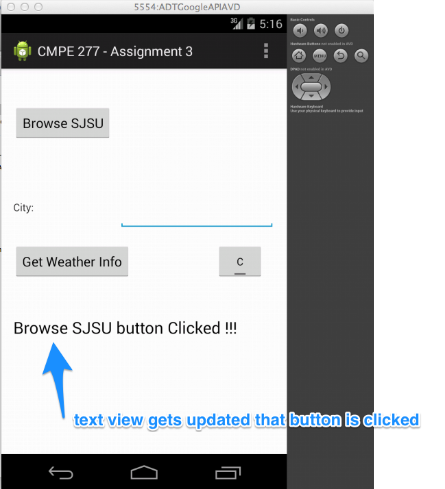
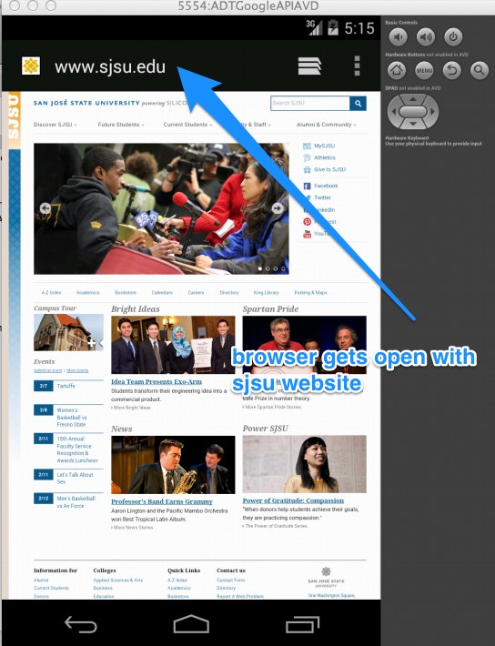
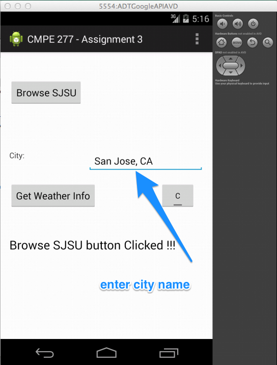
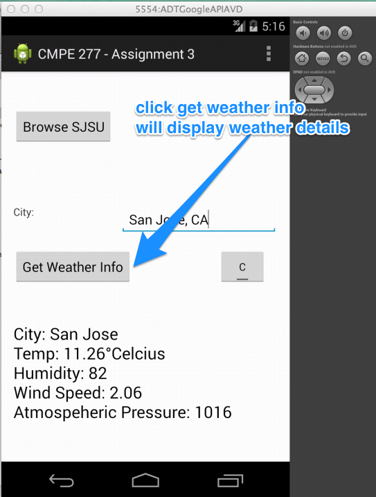
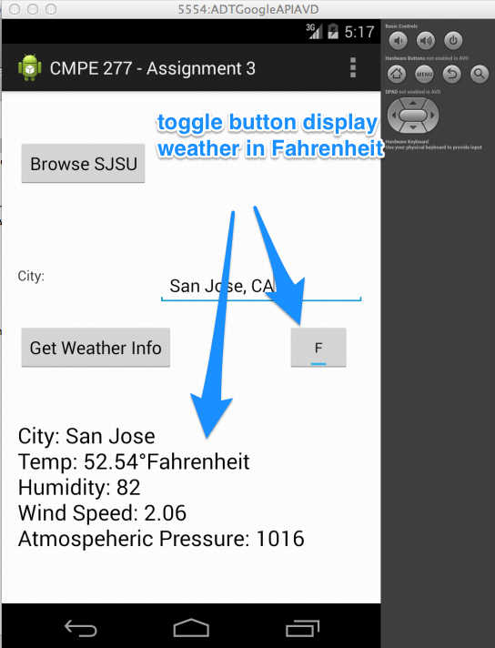
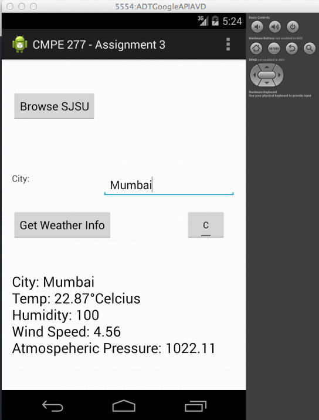

CMPE277Assgn3-AndroidApp-AccessAPI
==================================

This is CMPE 277 Assignment 4 to learn following things:  

1. Usage of Intent to open other application from one application. E.g: Browser 
2. How to execute task in Async like calling API's. E.g: Weather.   

So  I have created an App to Browse SJSU Website &amp; Simple Weather app using open weather API's.

ScreenShots:
==============

